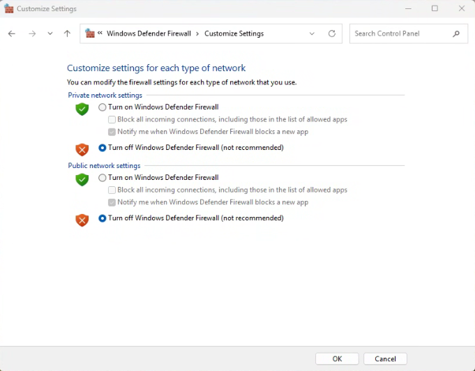
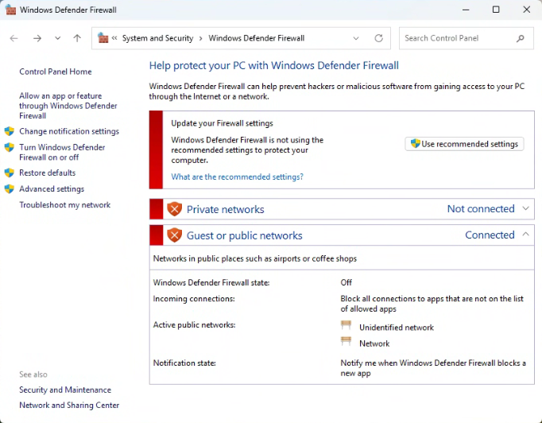
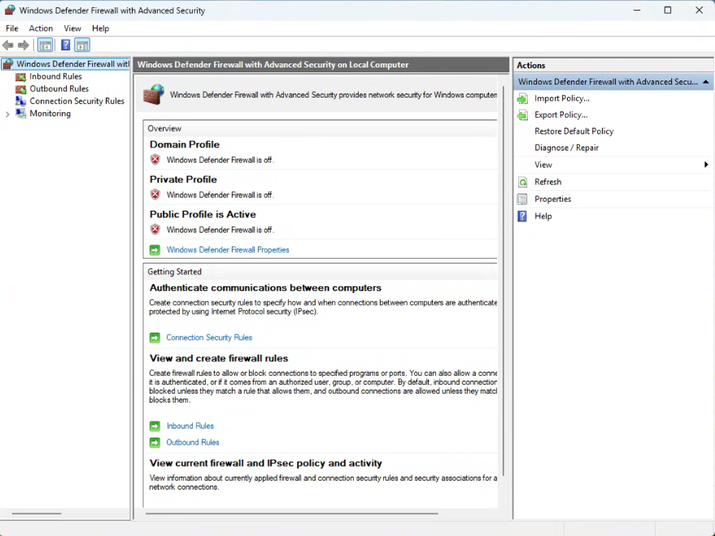
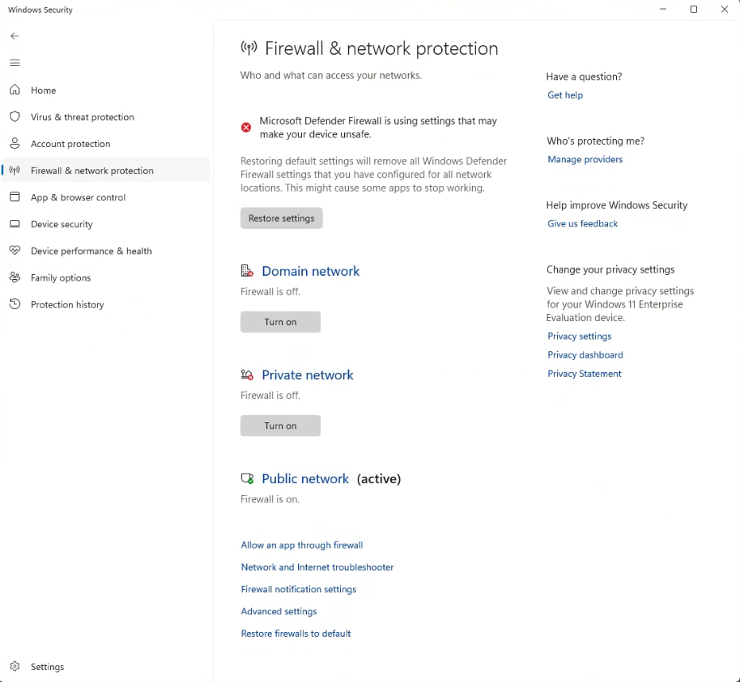
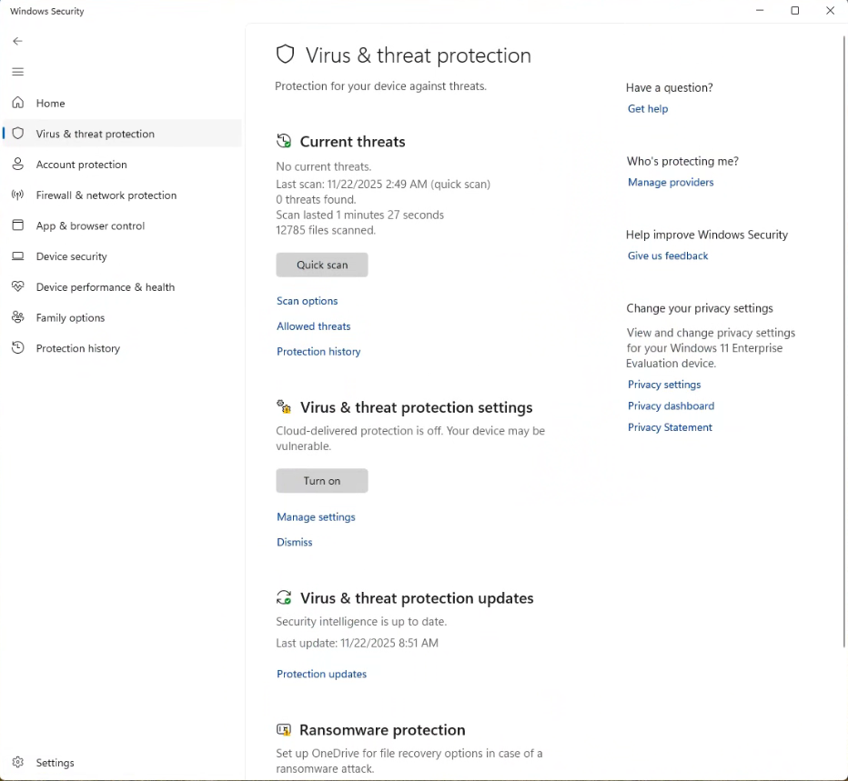
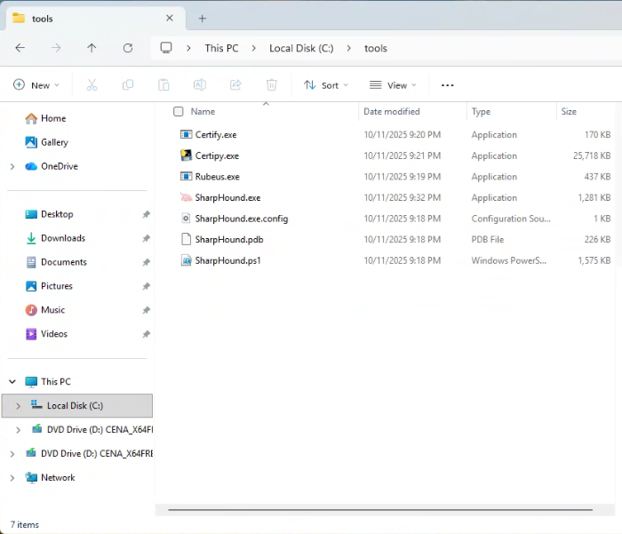

# Create a Windows 11 Evaluation VM
I created a <b>non-domain joined Windows 11 Enterprise VM</b> to provide an easy way to install and run various Windows based attack and discovery tools without changing any existing GOAD Domain servers directly. This <b>Windows 11 VM</b> will be used to explore/attack our existing  [Game of Active Directory - GOAD system](https://github.com/Orange-Cyberdefense/GOAD). 

The [<b>SharpHound.exe</b>](https://github.com/SpecterOps/SharpHound) tool in particular extracts all the <b>Active Directory</b> data needed for security professionals who need to understand, discover, and visualize <b>Attack Paths</b> through the use of [<b>BloodHound-CE</b>](https://bloodhound.specterops.io/get-started/quickstart/community-edition-quickstart) . In my case, [<b>BloodHound-CE</b>](https://github.com/jjkirn/Bloodhound-CE)] is installed on my <b>Kali</b> linux VM. Therefore, a tool such as <b>WinSCP</b> is used to transfer the <b>SharpHound</b> extracted data back to the <b>Kali</b> VM where it is analyzed using <b>BloodHound-CE</b>.

Here is a list of some tools I suggest you install on this VM once you have completed the base install of this VM:
- <b>SharpHound.exe</b> (From BloodHound-CE)
- <b>Certipy.exe</b> (AD CS Attack & Enumeration Toolkit)
- <b>Certify.exe</b> (AD CS Attack & Enumeration Toolkit)
- <b>Rubeus.exe</b> (toolset for raw Kerberos interaction and abuses)
- <b>Notepad++.exe</b> (alternative to notepad.exe)
- <b>WinSCP.exe</b> (easy file transfer program)

These tools will be covered later.

<b>NOTES:</b>
- The <b>Windows 11 VM</b> is intended to be used as extension of the <b>GOAD v3 lab environment</b>. For me, this means using <b>VMware Workstation 17.x Pro</b> on a <b>Windows 10-11</b> host to create the <b>GOAD v3 Lab</b>. My host sytem has 64 GB RAM with more than enough disk space. Make sure your system has sufficent storage and RAM disk space.
- If you followed [my GOAD install writeup](https://github.com/jjkirn/GOAD), it identifies how create the full GOAD 5 VMs (DC01, DC02, DC03, SRV2, SRV3). It shows the VMs fit into 48 GB RAM.
- FYI, you no longer need a <b>"TPM Bybpass"</b> to install a Windows VM from ISO in a VMware Workstation Pro tool.

## STEPS ##

## 1. Download Microsoft EVAL ISO:
Start by downloading the ISO for the Windows products used in this lab:
- Download a [Windows 11 Enterprise Eval ISO](https://www.microsoft.com/en-us/evalcenter/evaluate-windows-11-enterprise)

## 2. Create the Base Windows 11 VM using the following requirements:
### Base Win11 VM
- Memory: 4 GB
- Processors: 2
- Hard Disk: 80 GB
- Network Adapter: NAT (VMnet8)
- Network Adapter 2: Host Only (VMnet2)
- CD: (Windows 11 Enterprise Eval ISO file)

## 3. Install Windows 11 Enterprise Eval VM

If you need help with detailed steps to install the <b>Windows 11 VM</b> [click here](/README2.md).

If you are familiar with the details of installing a <b>Windows 11 VM</b>, just power on the VM and complete all the install steps. When complete, just move on to the next step.

## 4. Download and Install generic support tools
The following tools are not required but I find very useful. They can be downloaded via any Web browser:
- [Notepad++](https://notepad-plus-plus.org/)
- [WinSCP](https://winscp.net/eng/index.php)

<b>Notepad++</b> is a free source code editor and Notepad replacement that supports several programming languages.

<b>WinSCP</b> is a popular SFTP client and FTP client for Microsoft Windows. It supports copying files between a local computer and remote servers using FTP, FTPS, SCP, SFTP, WebDAV or S3 file transfer protocol.

Just follow the install instuctions provided by execting the downloaded application.

## 5. Download and Install Active Directory (AD) tools
- Turn off Windows Firewall and Virus Threat Protection
<p align="center">
     
</p>
<p align="center">
     
</p>
<p align="center">
     
</p>
<p align="center">
     
</p>
<p align="center">
     
</p>

- Create the tools directory at <b>C:\tools</b> and install tools:

I found the below tools invaluable for exloring Active Directy features. I installed all these tool at <b>C:\tools\ </b>.

<p align="center">
     
</p>

- [<b>Certipy.exe</b>](https://github.com/ly4k/Certipy/releases/tag/5.0.4)

<b>Certipy</b> is a powerful offensive and defensive toolkit for enumerating and abusing <b>Active Directory Certificate Services (AD CS)</b>. It helps red teamers, penetration testers, and defenders assess AD CS misconfigurations - including full support for identifying and exploiting all known <b>ESC1-ESC16</b> attack paths.

- [<b>Certify.exe</b>](https://github.com/r3motecontrol/Ghostpack-CompiledBinaries)

<b>Certify</b> is a C# tool to enumerate and abuse misconfigurations in <b>Active Directory Certificate Services (AD CS)</b>.

- [<b>Rubeus.exe</b>](https://github.com/r3motecontrol/Ghostpack-CompiledBinaries)

<b>Rubeus</b> is a C# toolset for raw <b>Kerberos</b> interaction and abuses.

- [<b>SharpHound.exe</b>](https://github.com/SpecterOps/SharpHound)

The best way to get a copy of the <b>SharpHound tools set</b> is to download it directly from a system that has <b>Bloodhound-CE</b> running (like your <b>Kali</b> linux VM). Once you have selected to download it from the <b>Bloodhound-CE</b> menu, you will need to transfer the .zip file (via the <b>WinSCP</b> applicion)  to our Windows 11 directory <b>C:\tools\ directory</b> and unzip it:

<p align="center">
     
</p>

## 6. Modify VM sytem configurations
- Modify Windows "<b>host</b>" file for GOAD server access:

File is located at <b>C:\Windows\System32\divers\etc\ </b> . Add the following at the end of the <b>hosts</b> file:

```
# GOAD
192.168.56.10   sevenkingdoms.local kingslanding
sevenkingdoms.local kingslanding
192.168.56.11   winterfell.north.sevenkingdoms.local north.sevenkingdoms.local winterfell
192.168.56.12   essos.local meereen.essos.local meereen
192.168.56.22   castelblack.north.sevenkingdoms.local castelblack
192.168.56.23   braavos.essos.local braavos
```

## 7. Review my Bloodhound-CE github

My [<b>guide</b>](https://github.com/jjkirn/Bloodhound-CE) to installing the latest <b>Bloodhound-CE</b> tools on <b>kali</b> linux and how to use them is available [here](https://github.com/jjkirn/Bloodhound-CE) .

The <b>guide</b> shows some of the steps for data transfer and several <b>Bloochoud-CE</b> queries of the <b>GOAD</b> data.